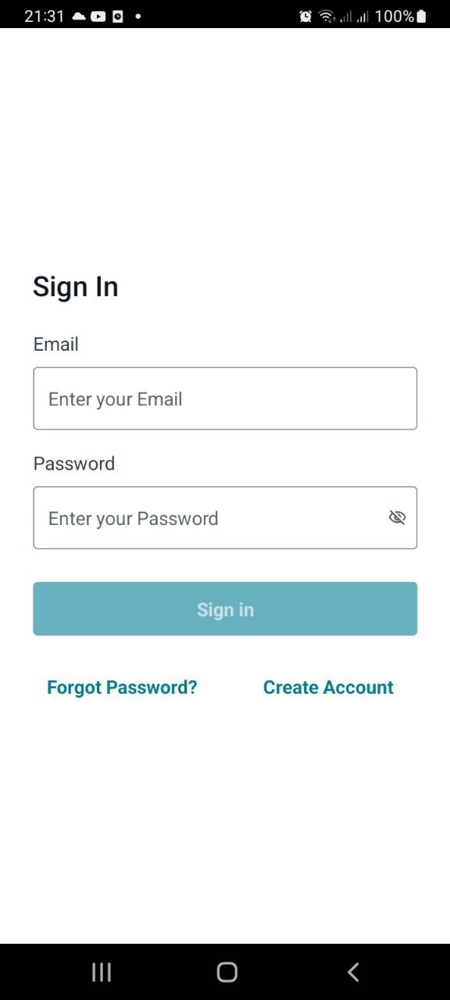
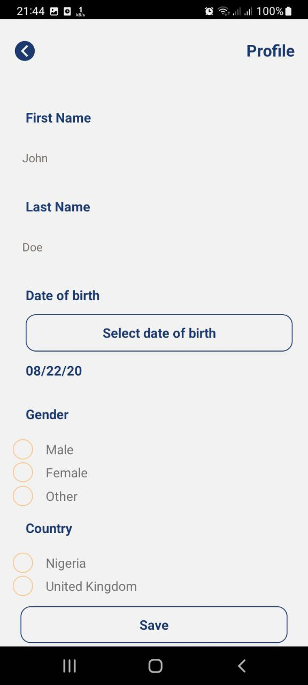
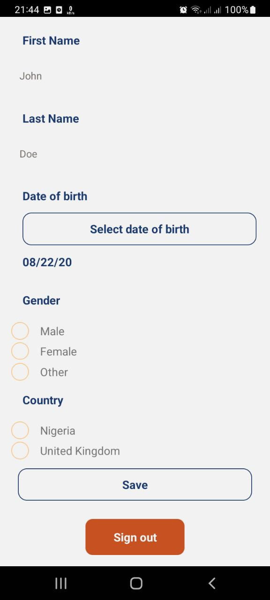
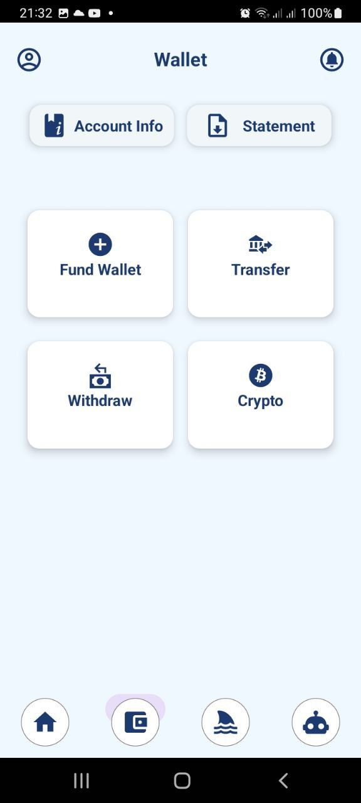

# shire-fin-hashnode
Fintech Application built during the Hashnode Hackathon (July 1 - July 31st 2023)

<h3> To get the app running </h3>

<ul>
	<li> git clone https://github.com/SamZing777/shire-fin-hashnode.git </li>
	<li> Install Packages from packages.json file </li>
	<li> Add your AWS Amplify and App Sync credentials </li>
	<li> npx react-native run-android </li>
	<li> Any data you enter are secured and encrypted </li>
	<li> Star the project </li>
	<li> More update will be added </li>
</ul>

<h3> App's Requirement </h3>

<ul>
	<li> React Native </li>
	<li> AWS (Amplify and AppSync) </li>
	<li> PayPal and Stripe for accepting payments </li>
	<li> Amadeus API for Hotels and Flights booking </li>
</ul>

<h3> App's Basic UI </h3>

 Link to Article's publication about the App on Hashnode 

<h3> Other Tools I use for Projects </h3>

<ul>
	<li> Docker </li>
	<li> Java </li>
	<li> SQL </li>
	<li> Python NumPy, Pandas, Matplotlib, Tensorflow, Selenium, ..... </li>
</ul>

